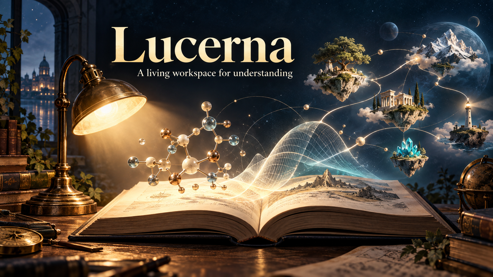

# Lucerna

**A living workspace for understanding.** Lucerna gives your AI host adaptive teaching, persistent learner context, learning pathways, and a local Paper Explorer where sources and interactive explanations live together.

Ask a question, bring a paper, or start a longer learning goal. Your agent can connect new ideas to what you already understand, remember useful bridges and unfinished questions, and revise the route as you learn. You can inspect, correct, or erase what it remembers.

[Explore Lucerna](https://stunspot.github.io/lucerna/) · [Download v0.3.0](dist/Lucerna-v0.3.0.zip) · [Installation guide](lucerna/INSTALL.md)

## What you can do

**Follow an idea.** Ask for a quick explanation or a curriculum that adapts as your understanding changes. Lucerna keeps goals, concepts, connections, and learning pathways in a workspace you control.

**Explore a source.** Import an arXiv paper or a local PDF, HTML, Markdown, or text document. Your agent can connect its explanation to source passages and author scenes you can manipulate: diagrams, plots, calculations, comparisons, and animations.

**Experiment.** Four included labs explore attention, memory and context, chemical equilibrium, and damped motion. Paper Explorer offers Experiment, Read, and Connections views, source search, named explanation editions, optional device narration, and standalone HTML export.

**Pick up where you left off.** The local workspace saves your library, reading position, scene settings, questions, and learner context outside the installed skill. Three visual skins—LAMPLIGHT, APERTURE, and MARGIN—change the interface while preserving your experiment.

## Get started

Download the ZIP above and install the complete `lucerna` folder as a skill in a host that can read skills, run commands, and open a browser. Lucerna needs Python 3.10 or newer. Follow the [installation guide](lucerna/INSTALL.md), then ask your agent:

> Use $lucerna. Help me start a learning workspace and explain something I have been trying to understand.

Lucerna is free. It needs no separate model API key; your AI host's usual model and tool costs still apply. Your learner data stays in the workspace you choose. See the [package README](lucerna/README.md) for runtime details and limits, and the [third-party notices](lucerna/THIRD-PARTY-NOTICES.md) for bundled dependencies.

[Collaborative Dynamics](https://collaborative-dynamics.com/) · [Support on Discord](https://discord.gg/stunspot)
